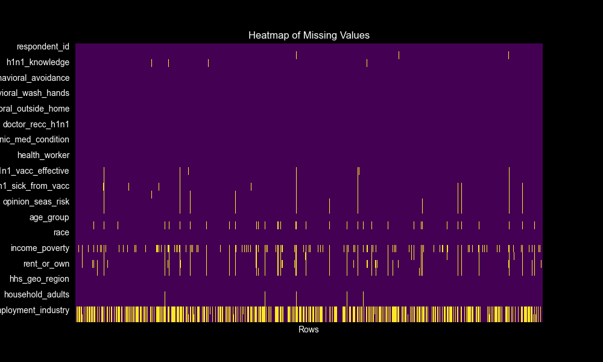

# Flu Shot Learning

## Overview
This repository contains the work for the "Flu Shot Learning: Predict H1N1 and Seasonal Flu Vaccines" competition hosted by Driven Data. The goal of this project is to predict how likely individuals are to receive their H1N1 and seasonal flu vaccines based upon various features collected in a survey.

## Data
The dataset includes characteristics like behavioral responses, opinions, and personal information gathered from respondents. Some of the features have missing values, which are crucial for the predictive modeling aspect of the project.

## Predictive Models
We employ machine learning models to predict the likelihood of vaccine uptake. Specifically, logistic regression models are used, addressing class imbalances where necessary.

## Repository Structure
- `data/` - Contains the training and test datasets.
- `models/` - Saved models after training.
- `notebooks/` - Jupyter notebooks with exploratory data analysis and model development.
- `submissions/` - Prediction files ready for submission to the competition.
- `images/` - Visualizations generated during analysis, including the heatmap of missing values.

## Usage
Clone the repository, install the required packages listed in `requirements.txt`, and run the Jupyter notebooks to replicate the analysis and predictions.

## Contributions
Contributions are welcome. Please open an issue or pull request if you would like to contribute to the project.

## License
This project is open-source and available under the MIT license.
